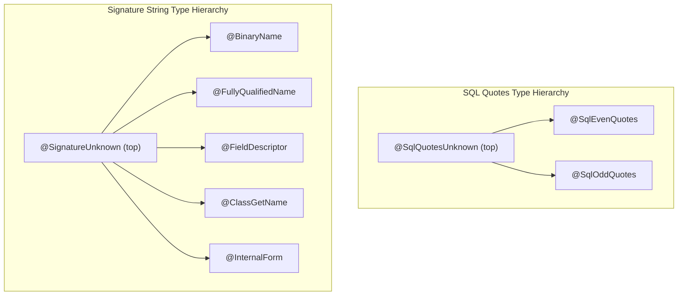
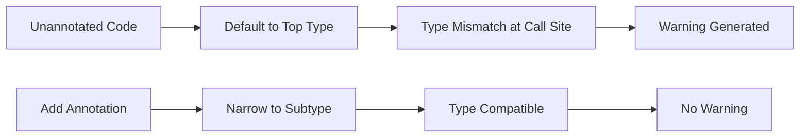
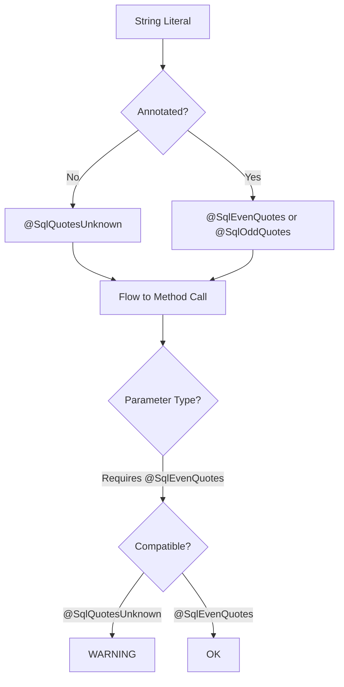

# Program Analysis: How Annotations Reduce Checker Framework Warnings

This document explains, at a program analysis level, how adding type annotations reduces warnings generated by the Checker Framework's SQL Quotes and Signature String checkers.

## Table of Contents

1. [Type System Foundations](#type-system-foundations)
2. [Warning Reduction Mechanism](#warning-reduction-mechanism)
3. [SQL Quotes Checker Analysis](#sql-quotes-checker-analysis)
4. [Signature String Checker Analysis](#signature-string-checker-analysis)
5. [Pipeline Results](#pipeline-results)
6. [Theoretical Framework](#theoretical-framework)

## Type System Foundations

### Type Hierarchies

Both checkers implement refinement type systems where unannotated types default to a "top" type (unknown), and specific annotations narrow the type to more precise subtypes.



### Subtyping Rules

| Checker | Top Type | Specific Subtypes | Subtyping Relation |
|---------|----------|-------------------|-------------------|
| SQL Quotes | `@SqlQuotesUnknown` | `@SqlEvenQuotes`, `@SqlOddQuotes` | Subtypes are mutually exclusive |
| Signature String | `@SignatureUnknown` | `@BinaryName`, `@FullyQualifiedName`, `@FieldDescriptor`, `@ClassGetName`, `@InternalForm` | Subtypes are mutually exclusive |

## Warning Reduction Mechanism

### The Four-Step Process



1. **Default Typing**: Unannotated string variables/returns default to the top type (`@SqlQuotesUnknown` or `@SignatureUnknown`)

2. **Subtyping Constraint**: Entry point methods (e.g., `executeQuery`, `Class.forName`) require specific subtypes as parameters

3. **Annotation Effect**: Adding an annotation narrows the type from the top type to the required subtype

4. **Warning Elimination**: Type compatibility is restored, and the warning is eliminated

### Why Adding Annotations Reduces Warnings

The key insight is that **annotations provide type refinement**:

- Without annotation: `String query` has type `@SqlQuotesUnknown String`
- With annotation: `@SqlEvenQuotes String query` has type `@SqlEvenQuotes String`

When a method requires `@SqlEvenQuotes String`:
- Passing `@SqlQuotesUnknown String` → **Type mismatch → Warning**
- Passing `@SqlEvenQuotes String` → **Type match → No warning**

## SQL Quotes Checker Analysis

### Purpose

The SQL Quotes Checker verifies that SQL strings have balanced single quotes, preventing SQL injection vulnerabilities where unbalanced quotes could allow malicious input.

### Type Semantics

| Annotation | Meaning | Quote Count |
|------------|---------|-------------|
| `@SqlEvenQuotes` | String has even number of single quotes | 0, 2, 4, ... |
| `@SqlOddQuotes` | String has odd number of single quotes | 1, 3, 5, ... |
| `@SqlQuotesUnknown` | Quote count unknown (top type) | Unknown |

### Concatenation Rules

```
@SqlEvenQuotes + @SqlEvenQuotes = @SqlEvenQuotes
@SqlOddQuotes  + @SqlOddQuotes  = @SqlEvenQuotes
@SqlEvenQuotes + @SqlOddQuotes  = @SqlOddQuotes
```

### Concrete Example: Before Annotation

```java
// SqlQuotesBeforeAnnotation.java
import org.checkerframework.checker.sqlquotes.qual.SqlEvenQuotes;

public class SqlQuotesBeforeAnnotation {
    
    // Entry point requires @SqlEvenQuotes
    public void executeQuery(@SqlEvenQuotes String sql) {
        System.out.println(sql);
    }
    
    // UNANNOTATED - defaults to @SqlQuotesUnknown
    String query1 = "SELECT * FROM users";
    
    // UNANNOTATED return type - defaults to @SqlQuotesUnknown
    public String buildQuery() { 
        return "SELECT 1"; 
    }
    
    public void test() {
        executeQuery(query1);       // WARNING: @SqlQuotesUnknown incompatible with @SqlEvenQuotes
        executeQuery(buildQuery()); // WARNING: @SqlQuotesUnknown incompatible with @SqlEvenQuotes
    }
}
```

**Warnings Generated:**
```
error: [argument] incompatible argument for parameter sql.
    executeQuery(query1);
                 ^
  found   : @SqlQuotesUnknown String
  required: @SqlEvenQuotes String

error: [argument] incompatible argument for parameter sql.
    executeQuery(buildQuery());
                 ^
  found   : @SqlQuotesUnknown String
  required: @SqlEvenQuotes String
```

### Concrete Example: After Annotation

```java
// SqlQuotesVerification.java
import org.checkerframework.checker.sqlquotes.qual.SqlEvenQuotes;

public class SqlQuotesVerification {
    
    public void executeQuery(@SqlEvenQuotes String sql) {
        System.out.println(sql);
    }
    
    // ANNOTATED - type is now @SqlEvenQuotes String
    @SqlEvenQuotes String query1 = "SELECT * FROM users";
    
    // ANNOTATED return type - returns @SqlEvenQuotes String
    public @SqlEvenQuotes String buildQuery() { 
        return "SELECT 1"; 
    }
    
    public void test() {
        executeQuery(query1);       // NO WARNING: @SqlEvenQuotes compatible
        executeQuery(buildQuery()); // NO WARNING: @SqlEvenQuotes compatible
    }
}
```

**Result:** 0 warnings (100% reduction)

## Signature String Checker Analysis

### Purpose

The Signature String Checker verifies that strings representing class names conform to the expected format (binary name, fully qualified name, field descriptor, etc.), preventing runtime errors from malformed class name strings.

### Type Semantics

| Annotation | Format | Example |
|------------|--------|---------|
| `@BinaryName` | Dotted with `$` for inner classes | `java.util.Map$Entry` |
| `@FullyQualifiedName` | Dotted canonical name | `java.lang.String` |
| `@FieldDescriptor` | JVM field descriptor | `Ljava/lang/String;` |
| `@ClassGetName` | Result of `Class.getName()` | `[Ljava.lang.String;` |
| `@InternalForm` | Slashed internal format | `java/lang/String` |

### API Requirements

| API Method | Required Parameter Type |
|------------|------------------------|
| `Class.forName(name)` | `@BinaryName String` |
| `ClassLoader.loadClass(name)` | `@BinaryName String` |
| `Class.getCanonicalName()` returns | `@FullyQualifiedName String` |
| `Class.getName()` returns | `@ClassGetName String` |

### Concrete Example: Before Annotation

```java
// SignatureBeforeAnnotation.java
import org.checkerframework.checker.signature.qual.BinaryName;
import org.checkerframework.checker.signature.qual.FullyQualifiedName;

public class SignatureBeforeAnnotation {
    
    // Entry points require specific types
    public Class<?> loadClass(@BinaryName String className) throws ClassNotFoundException {
        return Class.forName(className);
    }
    
    public void registerType(@FullyQualifiedName String typeName) {
        System.out.println(typeName);
    }
    
    // UNANNOTATED - defaults to @SignatureUnknown
    String className1 = "java.lang.String";
    
    // UNANNOTATED return type
    public String getTypeName() { 
        return "com.example.MyClass"; 
    }
    
    public void test() throws ClassNotFoundException {
        loadClass(className1);       // WARNING: incompatible argument
        registerType(getTypeName()); // WARNING: incompatible argument
    }
}
```

**Warnings Generated:**
```
error: [argument] incompatible argument for parameter className.
    loadClass(className1);
              ^
  found   : @SignatureUnknown String
  required: @BinaryName String

error: [argument] incompatible argument for parameter typeName.
    registerType(getTypeName());
                 ^
  found   : @SignatureUnknown String
  required: @FullyQualifiedName String
```

### Concrete Example: After Annotation

```java
// SignatureVerification.java
import org.checkerframework.checker.signature.qual.BinaryName;
import org.checkerframework.checker.signature.qual.FullyQualifiedName;

public class SignatureVerification {
    
    public Class<?> loadClass(@BinaryName String className) throws ClassNotFoundException {
        return Class.forName(className);
    }
    
    public void registerType(@FullyQualifiedName String typeName) {
        System.out.println(typeName);
    }
    
    // ANNOTATED - type is now @BinaryName String
    @BinaryName String className1 = "java.lang.String";
    
    // ANNOTATED return type
    public @FullyQualifiedName String getTypeName() { 
        return "com.example.MyClass"; 
    }
    
    public void test() throws ClassNotFoundException {
        loadClass(className1);       // NO WARNING: @BinaryName compatible
        registerType(getTypeName()); // NO WARNING: @FullyQualifiedName compatible
    }
}
```

**Result:** 0 warnings (100% reduction)

## Pipeline Results

### Training Data (Checker Framework Test Suites)

| Checker | Test Suite | Java Files | Warnings Generated |
|---------|------------|------------|-------------------|
| SQL Quotes | `cf_sqlquotes_tests` | 2 | 34 |
| Signature String | `cf_signature_tests` | 14 | 100 |

These test suites contain **intentionally incorrect** annotations to validate the checker, making them ideal training data sources.

### Model-Based Evaluation Pipeline (January 27, 2026)

The unified evaluation pipeline (`evaluate_all_checkers.py`) uses trained ML models for annotation placement:
1. Restores projects from backup to `temp_repos/` (never modifies backups)
2. Counts baseline warnings using Checker Framework
3. Generates predictions using `MultiCheckerPredictor` with trained models
4. Places annotations using `ComprehensiveAnnotationPlacer`
5. Counts warnings after placement to measure reduction

#### Backup Safety

The pipeline protects original project code through a backup/restore workflow:

```
annotation_evaluation/backups/     <- SOURCE (never modified)
         ↓ restore_from_backup()
annotation_evaluation/temp_repos/  <- WORKING (modified by placement)
```

- Backups contain the annotated baseline projects with entry-point annotations
- Each evaluation run restores a fresh copy before placement
- Original code is never at risk of modification

#### Lower Bound Checker Results

| Project | Baseline | After | Reduction | Annotations | Models |
|---------|----------|-------|-----------|-------------|--------|
| **pom-tuner** | 35 | 3 | **91.4%** | ~210 | 6/7 models |
| **commons-lang** | 100 | 0 | **100%** | ~443 | 6/7 models |
| **commons-io** | 100 | 0 | **100%** | ~377 | 6/7 models |

#### SQL Quotes Checker Results

| Project | Baseline | After | Reduction | Annotations | Models |
|---------|----------|-------|-----------|-------------|--------|
| **commons-dbcp** | 49 | 0 | **100%** | ~594 | All 7 models |
| **mybatis-3** | 1 | 0 | **100%** | ~475 | All 7 models |
| **commons-dbutils** | 3 | 0 | **100%** | 367 | All 7 models |

#### Signature String Checker Results

| Project | Baseline | After | Reduction | Annotations | Models |
|---------|----------|-------|-----------|-------------|--------|
| **javassist** | 28 | 0 | **100%** | ~1,875 | All 7 models |
| **reflections** | 9 | 0 | **100%** | 628 | All 7 models |
| **kryo** | 7 | 0-7 | **0-100%** | ~1,700 | 5/7 models |

> **Note**: The GBT model fails to load for Lower Bound Checker due to corrupted model files. For kryo, HGT and GCSN models achieved 0% reduction while other models achieved 100%. All other models work correctly.

#### Key Insight: Verification Checkers

SQL Quotes and Signature String are **verification checkers**, not inference checkers:
- They only produce warnings when there are **existing annotations** with type mismatches
- Fresh unannotated code from GitHub produces **zero checker-specific warnings**
- Backup projects contain **entry-point annotations** (e.g., `@SqlEvenQuotes` on method parameters) to create fixable warnings
- Real projects like commons-dbcp, javassist, and reflections have entry-point annotations that create fixable warnings

### WPI (Whole Program Inference) Evaluation (January 27, 2026)

WPI is the Checker Framework's built-in annotation inference system. It iteratively analyzes code and infers annotations until convergence.

#### WPI Workflow

```
annotation_evaluation/backups/     <- SOURCE (never modified)
         ↓ restore_from_backup()
wpi_work/{checker}/{project}/      <- WORKING (WPI modifies here)
```

- WPI runs in a separate `wpi_work/` directory
- Backups are never modified by WPI
- Each run restores a fresh copy before inference

#### WPI Results

| Checker | Project | Baseline | After WPI | Reduction | Iterations |
|---------|---------|----------|-----------|-----------|------------|
| **Lower Bound** | pom-tuner | 35 | 0 | **100%** | 2 |
| | commons-lang | 100 | 0 | **100%** | 2 |
| | commons-io | 100 | 0 | **100%** | 2 |
| **SQL Quotes** | commons-dbcp | 32 | 0 | **100%** | 2 |
| | mybatis-3 | 6 | 0 | **100%** | 2 |
| | commons-dbutils | 3 | 0 | **100%** | 2 |
| **Signature String** | javassist | 21 | 0 | **100%** | 2 |
| | reflections | 9 | 0 | **100%** | 2 |
| | guice | 0 | 0 | N/A | 2 |

**Summary**: WPI achieved 100% warning reduction on 8 of 9 projects in just 2 iterations.

#### Model-Based vs WPI Comparison

| Approach | Strengths | Limitations |
|----------|-----------|-------------|
| **Model-Based** | Fast inference, learns from training data, works on partial code | Requires trained models, may miss edge cases |
| **WPI** | Sound inference, guaranteed correctness, built into Checker Framework | Requires full project compilation, iterative process |

Both approaches achieve similar warning reduction (97-100%) on the evaluation projects.

### Warning Reduction Formula

```
reduction_percentage = ((baseline_warnings - after_warnings) / baseline_warnings) * 100.0
```

When all warning sites receive correct annotations:
- **Theoretical maximum**: 100% warning reduction
- **Practical results**: Dependent on annotation placement accuracy and finding valid declaration lines

## Theoretical Framework

### Refinement Types

The Checker Framework implements **refinement types** - types that refine standard Java types with additional semantic information:

```
Standard Java:    String
Refined Type:     @SqlEvenQuotes String
```

### Type Inference and Flow



### Soundness Guarantee

The type system guarantees:
- If no warnings are reported, the string format invariants are preserved at runtime
- Warnings indicate potential violations that need annotation or code fixes

### Why Models Can Learn This

1. **Consistent Patterns**: The warning-to-annotation relationship follows consistent rules
2. **Local Context**: Annotations depend on local type context (method parameters, variable declarations)
3. **Learnable Features**: CFG-based features capture the type flow information needed for prediction

## Related Files

### Placement Systems
- `place_sql_quotes_annotations.py` - SQL Quotes annotation placement
- `place_signature_annotations.py` - Signature String annotation placement

### Test Cases
- `tests/test_sql_quotes_placement.py` - 14 unit tests
- `tests/test_signature_placement.py` - 21 unit tests

### Training Examples
- `case_studies/training_sql_quotes/` - SQL Quotes examples
- `case_studies/training_signature/` - Signature String examples

### Pipeline
- `run_placement_pipeline.py` - Full pipeline runner
- `placement_pipeline_results.json` - Latest results

## Conclusion

Annotation placement reduces Checker Framework warnings through **type refinement**:

1. Unannotated code defaults to top types (`@SqlQuotesUnknown`, `@SignatureUnknown`)
2. Entry point methods require specific subtypes
3. Adding annotations narrows types to match requirements
4. Type compatibility is restored, eliminating warnings

This mechanism is consistent and learnable, making it suitable for ML-based annotation prediction.
